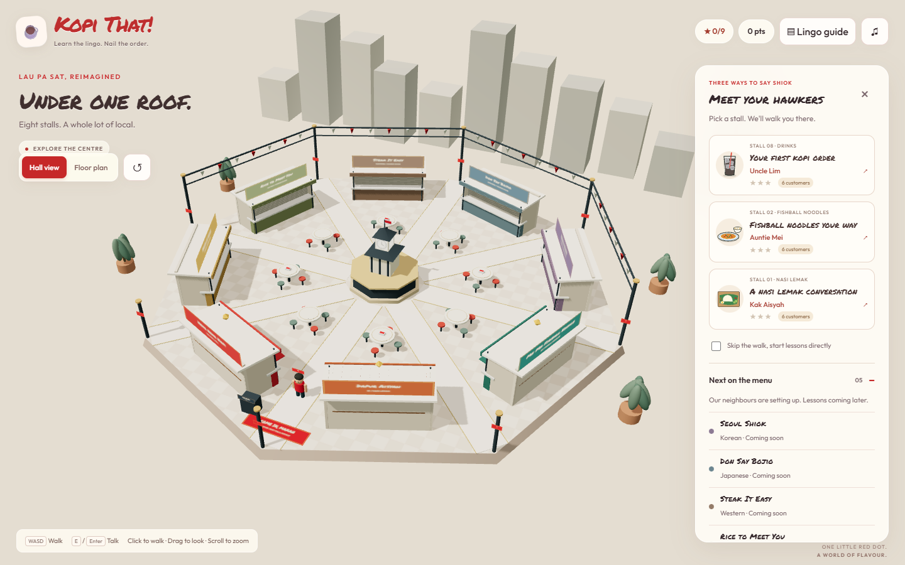

# Kopi That!

**Learn the lingo. Nail the order.**

Kopi That! helps newcomers feel at home in Singapore, one food order at a time. Explore a welcoming 3D hawker centre, meet the people behind the counters, and practise the words you will actually use when ordering lunch.

A phrasebook can translate “coffee.” Kopi That! lets you work out **“Kopi O Siew Dai Peng”** in context: black coffee, less sugar, iced. Customers describe what they want; you assemble an order, see what it means, and get friendly feedback from the hawker. Mistakes are opportunities to practise, with no queue waiting behind you.

The setting is a stylised **Lau Pa Sat-inspired hall**, with Singapore's food culture, everyday Singlish ordering vocabulary, and a distinct conversational Malay lesson. It is an original procedural environment, not an architectural reconstruction or an official representation of the venue.



## Play the hawker trail

| Stall                   | Your guide | What you practise                                                  |
| ----------------------- | ---------- | ------------------------------------------------------------------ |
| Heng Heng Kopi          | Uncle Lim  | Kopi and teh, milk choices, sweetness and ice                      |
| Mei Mei Fishball Noodle | Auntie Mei | Noodle types, dry or soup, and chilli preferences                  |
| Dapur Aisyah            | Kak Aisyah | A Malay conversation about nasi lemak, extras, sambal and takeaway |

All three stalls are open from the start. Each has six customers, with:

- Clickable phrase chips, hover/focus/long-press definitions, and live food illustrations.
- Hints, undo, clear, retries, and explanations for incorrect choices or word order.
- Multi-turn Malay ordering, optional greetings and accepted phrase variants.
- Points, up to three stars per stall, replay, and a completion badge.
- A lingo guide, hawker etiquette tips, optional sound, and locally saved progress.

The game is single-player and uses guided, authored lessons. There is no microphone requirement, account, backend, live AI, or paid API dependency.

## A hawker centre under one roof

The full browser viewport is the 3D game. The logo, progress, lingo guide, sound controls and collapsible **Meet your hawkers** panel float over the hall. Lessons and dialogs are accessible HTML overlays over the same world. On smaller screens, open the hawker panel to choose a lesson or enable direct lessons.

An octagonal footprint, eight radial walkways, shared tables and a central clock pavilion echo the supplied layout reference. Switch between **Hall view** and **Floor plan**, then orbit or zoom to explore. The three original stalls remain playable; five shuttered neighbours are decorative placeholders with no interactions or lessons:

| Cuisine  | Coming-soon stall |
| -------- | ----------------- |
| Indian   | Prata of Gold     |
| Cai fan  | Rice to Meet You  |
| Western  | Steak It Easy     |
| Japanese | Don Say Bojio     |
| Korean   | Seoul Shiok       |

The visual identity pairs [Permanent Marker](https://fonts.google.com/specimen/Permanent+Marker) for the logo and headings with [Outfit](https://fonts.google.com/specimen/Outfit) for reading text. Singapore's [red and white national colours](https://www.nhb.gov.sg/what-we-do/our-work/community-engagement/education/resources/national-symbols/national-flag) inform the palette, using [Material Red 700, #D32F2F](https://m1.material.io/style/color.html) alongside warm white surfaces, neutral text and dark-mode overlay colours.

## Run locally

Install **Node.js 22.12+** (Node 24 LTS recommended), then run from this repository:

```sh
npm ci
npm run dev
```

Open the local address printed by Vite, usually [http://127.0.0.1:5173](http://127.0.0.1:5173).

Use the development server instead of opening `index.html` directly: browser modules and bundled dependencies need HTTP. The original [`Hawker Lingo Simulator.html`](Hawker%20Lingo%20Simulator.html) remains unchanged as a historical, standalone prototype. Make new application changes in `src/`.

### Controls

| Action                | Controls                                                                  |
| --------------------- | ------------------------------------------------------------------------- |
| Walk                  | WASD / arrow keys, or click/tap a clear floor area                        |
| Visit a stall         | Click its counter or choose its lesson card; your avatar walks there      |
| Talk nearby           | E / Enter, or the on-screen talk button                                   |
| Look around           | Drag the scene; scroll or pinch to zoom                                   |
| Reset camera          | Reset camera button                                                       |
| Learn without walking | Select “Skip the walk, start lessons directly”                            |
| Place an order        | Click phrase chips, then Place order; Enter also submits outside a button |
| Undo / close a dialog | Backspace / Escape                                                        |

A browser with WebGL 2 is needed for the 3D view. If it is unavailable or the graphics context is lost, the lesson list remains usable. Direct lessons also provide a keyboard-friendly route through every learning activity.

## Development

The application uses **Three.js**, its official **OrbitControls**, **Vite**, and **TypeScript** for the world, lesson data, domain rules and persistence. The extracted lesson UI uses JavaScript ES modules; TypeScript checks the typed modules, while ESLint covers both languages. **Vitest**, **Playwright**, **ESLint**, and **Prettier** provide regression tests and consistent code quality. Versions are recorded in `package-lock.json`.

```text
src/
  content/       Lesson definitions, eight-stall roster, glossary and hawker tips
  domain/        Ordering and scoring rules
  lessons/       Lesson flow and phrase-builder interactions
  state/         Validated, backwards-compatible browser progress
  art/           Original SVG food and character illustrations
  audio/         Optional Web Audio feedback
  ui/            Hub, feedback, dialogs and formatting
  world/         Three.js scene, procedural environment and navigation
  shared/        Small shared utilities
  styles/        Base lesson styles and the new experience design
  main.js        Application composition and screen transitions
tests/
  unit/          Content, evaluation, scoring, storage and navigation tests
  e2e/           Browser journeys, accessibility and fallback checks
```

The world loads in a separate module behind the title screen. The lesson controller does not depend on Three.js: the hub connects navigation to lesson entry through callbacks. Collision and route planning use a small, static 2D footprint of the hall, with A* routes around all eight counters, communal tables, the central pavilion and the tray return. A full physics engine would add cost without improving this fixed-floor walking mechanic.

Geometry, materials and textures are shared where appropriate and disposed when the scene is destroyed. Pixel density and shadow resolution are bounded, background/hidden scenes stop rendering, and decorative animation respects reduced-motion preferences. All 3D models are generated locally, and Permanent Marker and Outfit are bundled through Fontsource; no runtime model or font CDN is required. The 3D engine is loaded separately from the lesson interface (approximately 148 kB gzipped).

### Checks

```sh
npm run check          # ESLint, unit tests, TypeScript and production build
npm run format:check   # Formatting
npx playwright install chromium
npm run test:e2e       # Browser tests; starts the local server when needed
```

Browser tests run sequentially to avoid several software-rendered 3D contexts competing for the same machine. They include all 18 customers, the Malay conversation stages, saved progress, reset, hints/retries, mobile overlay layout, camera controls, placeholder separation, navigation and WebGL fallback.

GitHub Actions runs these checks for pushes and pull requests.

To make a production build:

```sh
npm run build
npm run preview
```

Deploy the generated `dist/` folder to a static host such as Amazon S3 with CloudFront. The relative asset base supports hosting under a subdirectory. There are no server credentials or environment variables to configure. The source HTML prototype is not included in the production build.

### Content and progress

Keep vocabulary, example orders and customer scenarios in `src/content/`; do not put new lesson rules into the scene. Every answer term must have a glossary entry, category and available chip. Malay stages are scored once per complete customer order. Add regression coverage when introducing a new ordering rule.

Progress uses the original `hawker-lingo-v1` local-storage key and lesson IDs (`drinks`, `noodles`, `nasi`). Existing valid progress is retained **when served from the same browser origin**. Moving from a `file://` prototype to localhost, or between ports/domains, does not transfer browser storage automatically. Clearing site data removes progress; there is no cross-device sync. If browser storage is unavailable, the game continues with in-memory progress for that session.

## Inspiration and scope

Inspired by [Kyoto Conversations / Komorebi](https://github.com/rpsouthall/hackathon-with-alan): learning a language by exploring a place and meeting local characters. This project adapts that idea to Singapore's hawker culture and retains the original Hawker Lingo prototype's lessons. Kyoto's multiplayer, proximity voice and live avatar services are not part of this implementation; no assets or service credentials from that repository are bundled here.

Bundled Three.js, Permanent Marker and Outfit license notices are included in [`public/THIRD_PARTY_NOTICES.txt`](public/THIRD_PARTY_NOTICES.txt) and copied into production builds.

The visual hall is deliberately compact and procedural. Further work could include commissioned environment art, recorded pronunciation, additional stalls, and content review with local speakers. Hawker phrasing and recipes vary; the authored examples describe the choices available at these fictional stalls.
