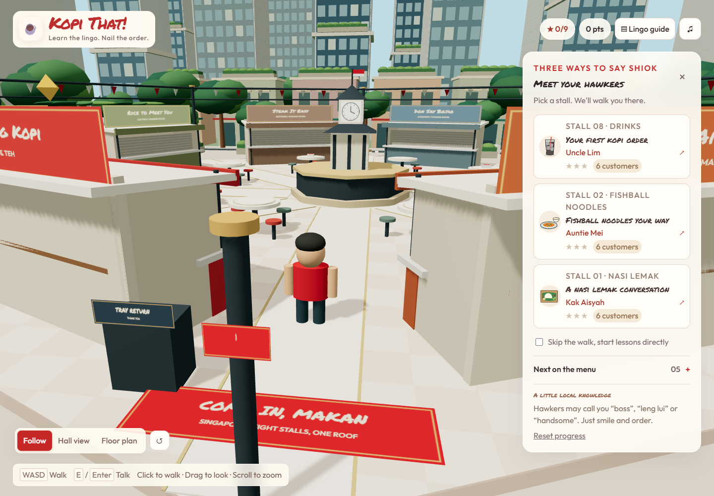

# Kopi That!

**Learn the lingo. Nail the order.**

Kopi That! helps newcomers feel at home in Singapore, one food order at a time. Explore a welcoming 3D hawker centre, meet the people behind the counters, and practise the words you will actually use when ordering lunch.

A phrasebook can translate “coffee.” Kopi That! lets you work out **“Kopi O Siew Dai Peng”** in context: black coffee, less sugar, iced. You are the customer: you queue up with a craving of your own, or an errand for a friend, assemble the order in local lingo, see what it means, and get friendly feedback from the hawker. Say it wrong and you see what you would actually be handed. Mistakes are opportunities to practise, with no queue waiting behind you.

The setting is a stylised **Lau Pa Sat-inspired hall**, with Singapore's food culture, everyday Singlish ordering vocabulary, and a distinct conversational Malay lesson. It is an original procedural environment, not an architectural reconstruction or an official representation of the venue.



## Play the hawker trail

| Stall                   | Your guide | What you practise                                                                                |
| ----------------------- | ---------- | ------------------------------------------------------------------------------------------------ |
| Heng Heng Kopi          | Uncle Lim  | Kopi, teh and Milo, milk choices, sweetness and ice                                              |
| Mei Mei Fishball Noodle | Auntie Mei | Noodle types, dry or soup, and chilli preferences                                                |
| Dapur Aisyah            | Kak Aisyah | A Malay conversation about nasi lemak, mee rebus, mee soto, lontong, extras, sambal and takeaway |

All three stalls are open from the start. Each has nine authored orders, your own cravings and errands for named friends, and every visit plays six of them in a random order, so the first craving changes each time. Lessons include:

- Clickable phrase chips, hover/focus/long-press definitions, and live food illustrations.
- Hints, undo, clear, retries, and explanations for incorrect choices or word order.
- Multi-turn Malay ordering, optional greetings and accepted phrase variants.
- Points, up to three stars per stall, replay, and a completion badge.
- A lingo guide, hawker etiquette tips, optional sound, and locally saved progress.

Lessons are single-player and work without an account, microphone, backend or paid API.

### AI cravings and Marcus

With fixed orders, returning players memorise answers instead of learning the lingo. When `VITE_AI_URL` is configured, each stall visit asks an AWS Lambda (`aws/ai-orders`) to have an OpenAI model write two fresh cravings using only that stall's vocabulary. The AI writes scenarios only and never judges answers. The game rejects any AI order that uses words outside the stall's chips, breaks the ordering sequence, contradicts its own wording (for example "warm" with an iced answer) or mentions non-halal food, rebuilds Malay conversations from the dish's real flow, and appends the exact expected order in plain English. Lessons open immediately with authored orders; valid AI orders replace later orders when they arrive, and any failure leaves the authored orders in place. See [AI orders setup](docs/ai-orders.md).

**Marcus**, an office worker on his lunch break, leaves a tissue packet on a table to _chope_ (reserve) his seat. Meet him from the **Lunch rush** card in the hawker panel, by clicking him or by walking near his table. Three suggested questions about chope, table sharing and courtesy always get authored answers. With `VITE_AI_URL` configured, players can also type questions about hawker food, ordering, Singlish and etiquette, which Marcus answers in character through the same Lambda; unrelated or sensitive questions are declined. **Save to People I Met** keeps learning notes and the transcript in a journal for the browser session.

The title screen asks for a display name on multiplayer builds; room links ignore capitals. Optional experimental **AWS AppSync Events** multiplayer lets visitors share the hall, see each other walk, sprint and jump, and see name tags fade during lessons. Lesson answers and progress never leave the browser. See [multiplayer setup and testing](docs/multiplayer.md).

## A hawker centre under one roof

The full browser viewport is the 3D game. The logo, progress, lingo guide, sound controls and collapsible **Meet your hawkers** panel float over the hall. Lessons and dialogs are accessible HTML overlays over the same world. On smaller screens, open the hawker panel to choose a lesson or enable direct lessons.

An octagonal footprint, eight radial walkways, shared tables and a central clock pavilion echo the supplied layout reference. The default **Follow** view plays like an action-adventure third-person game: your character accelerates, turns smoothly towards the direction you move, sprints and jumps, and the camera eases back behind them a moment after you stop dragging to look around. Sprinting widens the view slightly. Drag to orbit and scroll or pinch to zoom. The camera moves closer when a stall or the central pavilion blocks its view. **Isometric** switches to a Kyoto-style isometric diorama: a parallel projection at a fixed isometric angle that follows your character. Right-drag (or drag on touch) rotates it around you, scroll or pinch zooms, and left click still walks. Reset returns to the follow camera. The three original stalls remain playable; five shuttered neighbours are decorative placeholders with no interactions or lessons:

| Cuisine  | Coming-soon stall |
| -------- | ----------------- |
| Indian   | Prata of Gold     |
| Cai fan  | Rice to Meet You  |
| Western  | Steak It Easy     |
| Japanese | Don Say Bojio     |
| Korean   | Seoul Shiok       |

A surrounding fictional city district adds glass towers, planted sky terraces, low-rise shopfronts, tropical trees and palms, planters, pavements, crossings, streetlights and cars. The city surrounds the hall in third person; the isometric view cuts away foreground buildings to keep the playable area visible. The backdrop is decorative, with walking confined to the hawker hall.

Normal reading text inherits browser font sizes, including the browser’s preferred default text size. Panels wrap and scroll to accommodate it; only headings, the logo and decorative icons retain display sizing.

The visual identity pairs [Permanent Marker](https://fonts.google.com/specimen/Permanent+Marker) for the logo and headings with [Outfit](https://fonts.google.com/specimen/Outfit) for reading text. Singapore's [red and white national colours](https://www.nhb.gov.sg/what-we-do/our-work/community-engagement/education/resources/national-symbols/national-flag) inform the palette, using [Material Red 700, #D32F2F](https://m1.material.io/style/color.html) alongside warm white surfaces, neutral text and dark-mode overlay colours.

## Run locally

Install **Node.js 22.12+** (Node 24 LTS recommended), then run from this repository:

```sh
npm ci
npm run dev
```

Open the local address printed by Vite, usually [http://127.0.0.1:5173](http://127.0.0.1:5173).

Use the development server instead of opening `index.html` directly: browser modules and bundled dependencies need HTTP. The original [`Hawker Lingo Simulator.html`](Hawker%20Lingo%20Simulator.html) remains unchanged as a historical, standalone prototype. Make new application changes in `src/`.

### Controls

| Action                | Controls                                                                       |
| --------------------- | ------------------------------------------------------------------------------ |
| Run                   | WASD / arrow keys; on touch screens, the on-screen joystick                    |
| Sprint / jump         | Hold Shift, or push the joystick into its outer ring, to sprint; Space to jump |
| Visit a stall         | Click its counter or choose its lesson card; your avatar walks there           |
| Talk nearby           | E, or the on-screen talk button                                                |
| Look around           | Drag the scene; scroll or pinch to zoom                                        |
| Isometric view        | Isometric button; right-drag to rotate, scroll or pinch to zoom                |
| Reset camera          | Reset follow camera button                                                     |
| See the controls      | The ? button reopens the “How to play” popup shown on your first visit         |
| Learn without walking | Select “Skip the walk, start lessons directly”                                 |
| Place an order        | Click phrase chips, then Place order; Enter also submits outside a button      |
| Undo / close a dialog | Backspace / Escape                                                             |

A browser with WebGL 2 is needed for the 3D view. If it is unavailable or the graphics context is lost, the lesson list remains usable. Direct lessons also provide a keyboard-friendly route through every learning activity.

### Install as an app

Kopi That! is a Progressive Web App. On Android (Chrome), open the site and choose **Install app** (or ⋮ → _Add to Home screen_); on iPhone (Safari), choose Share → **Add to Home Screen**. Installed, it opens full screen with its own icon. The whole game is cached on first visit, so lessons and the 3D hall also work offline; the shared hall needs a connection. A new version is downloaded in the background and used from the next launch.

## Development

The application uses **Three.js**, its official **OrbitControls**, **Vite**, and **TypeScript** for the world, lesson data, domain rules and persistence. The extracted lesson UI uses JavaScript ES modules; TypeScript checks the typed modules, while ESLint covers both languages. **Vitest**, **Playwright**, **ESLint**, and **Prettier** provide regression tests and consistent code quality. Versions are recorded in `package-lock.json`.

```text
src/
  content/       Lesson definitions, eight-stall roster, glossary and hawker tips
  domain/        Ordering and scoring rules
  lessons/       Lesson flow and phrase-builder interactions
  state/         Validated, backwards-compatible browser progress
  art/           Original SVG food and character illustrations
  audio/         Optional Web Audio feedback
  ui/            Hub, feedback, dialogs and formatting
  world/         Three.js scene, follow camera, instanced city, hall and navigation
  net/           Optional AppSync/relay transports, validated messages and presence
  ai/            AI craving requests, validation and authored-order fallback
  agents/        Marcus's dialogue, session memory and journal
  shared/        Small shared utilities
  styles/        Base lesson styles and the new experience design
  main.js        Application composition and screen transitions
tests/
  unit/          Content, evaluation, scoring, storage, navigation, AI order and Marcus tests
  e2e/           Browser journeys, accessibility and fallback checks
```

The world loads in a separate module behind the title screen. The lesson controller does not depend on Three.js: the hub connects navigation to lesson entry through callbacks. Collision and route planning use a small, static 2D footprint of the hall, with A* routes around all eight counters, communal tables, the central pavilion and the tray return. A full physics engine would add cost without improving this fixed-floor walking mechanic.

City windows and foliage use instanced meshes to keep draw calls bounded. Geometry, materials and textures are shared where appropriate and disposed when the scene is destroyed. Pixel density and shadow resolution are bounded, background/hidden scenes stop rendering, and decorative animation respects reduced-motion preferences. All 3D models are generated locally, and Permanent Marker and Outfit are bundled through Fontsource; no runtime model or font CDN is required. The 3D engine is loaded separately from the lesson interface (approximately 149 kB gzipped).

### Checks

```sh
npm ci --prefix aws/ai-orders   # Lambda dependencies used by unit tests
npm run check          # ESLint, unit tests, TypeScript and production build
npm run format:check   # Formatting
npx playwright install chromium
npm run test:e2e       # Browser tests; starts the local server when needed
```

Browser tests run sequentially to avoid several software-rendered 3D contexts competing for the same machine. They play all 27 authored orders in written order (`?orders=all`, which also disables AI orders), the Malay conversation stages, saved progress, reset, hints/retries, mobile overlay layout, camera controls, placeholder separation, navigation and WebGL fallback.

GitHub Actions runs these checks for pushes and pull requests.

To make a production build:

```sh
npm run build
npm run preview
```

Deploy the generated `dist/` folder to a static host such as Amazon S3 with CloudFront or AWS Amplify Hosting. The relative asset base supports hosting under a subdirectory. Single-player needs no environment configuration. For the experimental shared hall, configure the three AppSync values in [.env.example](.env.example) at build time and follow [the multiplayer guide](docs/multiplayer.md). For AI cravings and Marcus's typed questions, deploy the Lambda in [the AI orders guide](docs/ai-orders.md) and set `VITE_AI_URL` at build time. The source HTML prototype is not included in the production build.

The build also generates the app manifest and a Workbox service worker (`sw.js`) through `vite-plugin-pwa`; app icons live in `public/icons/`. The service worker only exists in production builds, so `npm run dev` and the tests run without it. Installation and offline play need HTTPS (or localhost), which Amplify Hosting and CloudFront provide.

### Content and progress

Keep vocabulary, example orders, cravings and friend errands in `src/content/`; do not put new lesson rules into the scene. Every answer term must have a glossary entry, category and available chip. Malay stages are scored once per complete order. Add regression coverage when introducing a new ordering rule.

Progress uses the original `hawker-lingo-v1` local-storage key and lesson IDs (`drinks`, `noodles`, `nasi`). Existing valid progress is retained **when served from the same browser origin**. Moving from a `file://` prototype to localhost, or between ports/domains, does not transfer browser storage automatically. Clearing site data removes progress; there is no cross-device sync. If browser storage is unavailable, the game continues with in-memory progress for that session.

## Inspiration and scope

Inspired by [Kyoto Conversations / Komorebi](https://github.com/rpsouthall/hackathon-with-alan): learning a language by exploring a place and meeting local characters. This project adapts that idea to Singapore's hawker culture and retains the original Hawker Lingo prototype's lessons. Experimental multiplayer uses our own AppSync Events integration; proximity voice and Kyoto's avatar services are outside the scope. No assets or service credentials from that repository are bundled here.

Bundled Three.js, Permanent Marker and Outfit license notices are included in [`public/THIRD_PARTY_NOTICES.txt`](public/THIRD_PARTY_NOTICES.txt) and copied into production builds.

The visual hall is deliberately compact and procedural. Further work could include commissioned environment art, recorded pronunciation, additional stalls, and content review with local speakers. Hawker phrasing and recipes vary; the authored examples describe the choices available at these fictional stalls.
